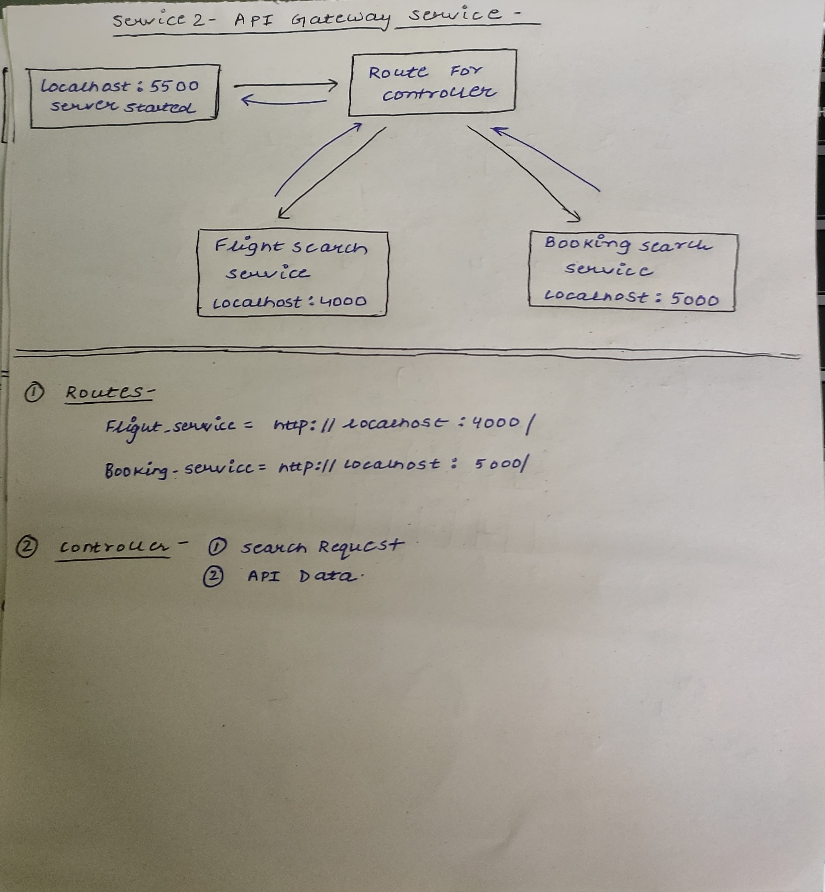

# Flight API-Gateway Service
This repository contains the source code and assets of Flight Api-Gateway Service . The purpose of this Repository is Gateway the all Api that are Comming via Auth for as -
 
 1. Flight Search Service (Availability of Flight, Date, Time, Price)
 2. Flight Booking Service (Booking Status, And ticket Booking)

## Block Diagram 

## Features

## Technologies Used
* Nodejs: The http module and Tcp connection is used.
* Expressjs: Nodejs popular Framework Expressjs and its server is used.
* MySql: Database MySql is used to store all the flights Information.
* Sequelize-Cli: Sql Queries written by Sequleize framework maintained by MySql officialy.
* Bootstrap: Utilize the Bootstrap framework to ensure a responsive design.
* Postman: Used the Postman to request all Raw Api calls(Post , Get , Patch).
* Git: Version control system for tracking changes.
* GitHub Pages: Deploy the Service easily using GitHub Pages for free hosting.

## Credits

<!-- * https://undraw.co/ provided me with free svg illustrations.
* https://freesvgillustration.com/ provided me with free svg illustrations.
* ChatGPT helped me in development, CSS formatting and debugging.
* Github for free deployment of website. -->

 For Accessing My Flight Booking Services and Interacting with My Database use- 
 * http://localhost:5500/api/v1/flights
 * API Gateway Link -> http://localhost:5500/flightService/api/v1/flights
 * API Gateway Link -> http://localhost:5500/bookingService/api/v1/bookings

## Contact
If you have any questions, suggestions, or feedback, feel free to contact me through the following channels:

* Email: anishm0423@gmail.com
* LinkedIn: https://www.linkedin.com/in/anish-mangal-35b758223/

Thank you for visiting my Flight API-Gateway service. I appriciate your Interest and support!